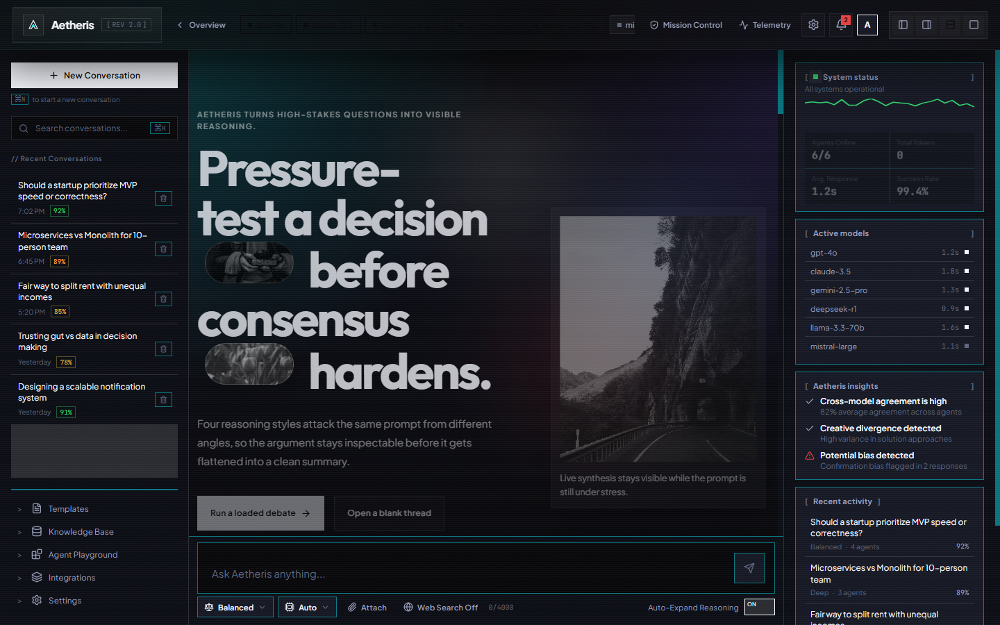
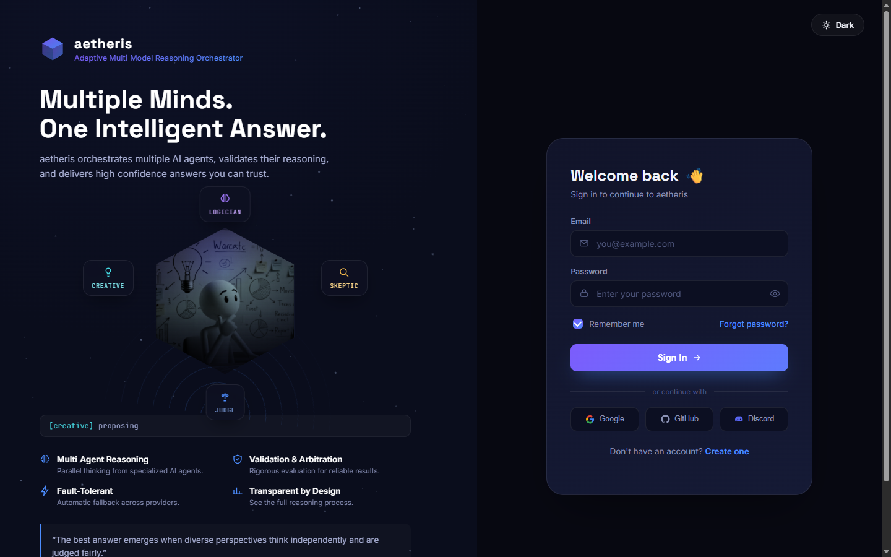

# aetheris — Adaptive Multi-Model Reasoning Orchestrator

> **[ACTIVE DEVELOPMENT]** A resilient multi-agent reasoning engine that orchestrates LLM agents through a validation-arbitration pipeline, utilizing dynamic runtime prompt layering, and automatically falling back across providers when models fail.

[](https://www.python.org/downloads/)
[](https://fastapi.tiangolo.com/)
[](https://docs.pydantic.dev/)

---

## What is aetheris?

aetheris is an advanced **multi-agent reasoning orchestrator** designed to produce high-quality, validated responses by running multiple AI agents in parallel and utilizing a synthesis judge to arbitrate the final result.

Instead of relying on a single raw model call, aetheris executes a robust **four-stage pipeline**:

1. **Breaker Gate** — A lightweight pre-filter checks if the system has sufficient context to answer. If not, it aborts immediately.
2. **Logician Agent** — Generates a strictly deductive, logically valid answer.
3. **Creative Agent** — Generates an orthogonal, lateral-thinking answer exploring edge cases and alternatives.
4. **Synthesis Judge** — Evaluates both answers for logical consistency, resolves contradictions, and produces a single authoritative response with a validation score.

The entire pipeline is **async-native**, runs with **bounded concurrency**, and **automatically falls back** across multiple LLM providers if a model is down, rate-limited, or returns garbage.

---

## Interface & Visual Preview

### Web Dashboard & Reasoning Pipeline
The primary triadic reasoning interface featuring live four-stage execution, agent reasoning expansion, and real-time telemetry:



### Authentication & Login Interface
Dedicated dark-mode glassmorphism login and registration page (`/login`) with JWT httpOnly cookie security:



---

## Technical Stack & Built-With

* **Core Backend:** Python 3.11+ (`asyncio`, `httpx.AsyncClient`)
* **API Framework:** FastAPI & Uvicorn for asynchronous server endpoints with strict CORS allowlists and CSRF origin checks
* **Database & Persistence:** Async PostgreSQL via SQLAlchemy 2.0 (`asyncpg`) with automated schema initialization on startup
* **Security & Auth:** Secure JWT authentication via `httpOnly`, `SameSite=Strict` cookies, password strength verification, and IP-scoped rate limiting
* **Data Validation:** Pydantic V2 & Pydantic-Settings for config validation and data contracts
* **Output Processing:** `json-repair` for parsing and correcting malformed JSON LLM outputs
* **Prompt Layout:** Strictly validated XML formats layered dynamically at runtime
* **Frontend Web Dashboard:** Modern React 19 + Vite + GSAP 3 animation engine with triadic dark-mode glassmorphism (`frontend/`)
* **Authentication UI:** Dedicated responsive HTML5/CSS3 cosmic dark-mode login interface (`aetheris_login.html`)
* **LLM Providers:** Native integration with OpenRouter, Groq, NVIDIA NIM, GitHub Models, and local Ollama

---

## Core Features & Architecture

```
┌─────────────┐     ┌─────────────────┐     ┌──────────────┐
│   User      │────▶│  FastAPI Server │────▶│  Breaker     │
│  (Browser)  │     │  / CLI REPL     │     │  Gate        │
└─────────────┘     └─────────────────┘     └──────────────┘
                                                     │
                              ┌──────────────────────┘
                              ▼
              ┌─────────────────────────────┐
              │  Logician Agent  │  Creative │
              │  (deductive)     │  Agent    │
              │                  │ (lateral) │
              └────────┬─────────┴─────┬─────┘
                       │                 │
                       ▼                 ▼
              ┌─────────────────────────────┐
              │    Synthesis Judge           │
              │  (arbitrate + validate)     │
              └──────────────┬──────────────┘
                             │
                             ▼
              ┌─────────────────────────────┐
              │  Final Answer + Score +     │
              │  Agent Reasoning (expandable)│
              └─────────────┬──────────────┘
```

### 1. Dynamic Runtime Prompt Layering
To enforce system instructions and role boundaries, aetheris dynamically layers prompts before sending payloads to the LLM:

* **Layer 1: `<ROLE>` Block** — Dynamically injected metadata defining the current role, active pipeline stage, objective, iteration count, and execution mode.
* **Layer 2: Runtime Prompts (`prompts/runtime/`)** — Global runtime constraints loaded and appended sequentially (`00_agent_runtime.xml`, `01_prompt_loader.xml`, `02_response_contract.xml`, `03_context_manager.xml`, etc.).
* **Layer 3: Agent Persona Prompts (`prompts/system/`)** — The specific instruction set matching the active agent (e.g. `05_logician.xml` or `06_creative.xml`).

All prompt templates are formatted in clean, single-root XML structures for structural validation and machine-readability.

### 2. Multi-Model Fallback & Circuit Breaking
* **Priority Routing:** If the primary model for a stage fails or times out, the system automatically escalates to a fallback provider chain.
* **Circuit Breaker:** Tracks failures per provider. If a provider fails 3 consecutive times, it enters cooldown (`DEAD`) and is bypassed for 60 seconds.
* **Simulation Mode:** Automatically matches environment variables. If no API keys are present, the system runs with deterministic mock responses to enable cost-free development. **In production (`AETHERIS_ENVIRONMENT=production`) this fallback is refused** — a missing provider key raises a `RuntimeError` and logs a `CRITICAL` alarm instead of silently returning fabricated output.

### 3. AETHERIS Architecture Integration
aetheris now incorporates the Adaptive Multi-Model Reasoning Orchestrator (AETHERIS) architecture, adding:
* **Conversation Management**: Multi-turn dialogue state with automatic token limit truncation.
* **Provider Registry**: Advanced circuit breaking, exponential backoff, and health monitoring.
* **Resource Limits**: Configurable rate limits per provider and per user, global concurrency controls.
* **Checkpoints**: State saving and restoration for long-running pipelines.
* **Streaming & Observability**: Real-time SSE streaming for all agent activities and telemetry.
* **Security Validation**: Robust prompt injection detection, input escaping, and secret scrubbing.

### 4. New API Endpoints & Request/Response Fields
* **New Endpoints**:
  * `/sessions`, `/sessions/{session_id}`, `/sessions/{session_id}/history` - Manage conversation sessions.
  * `/checkpoints/{request_id}`, `/checkpoints/{checkpoint_id}/restore` - Pipeline checkpoints.
  * `/providers/health`, `/providers/{provider_name}/recovery` - Monitor and recover provider health.
  * `/telemetry` - Aggregated metrics for decision engine, resources, and security.
  * `/auth/login`, `/auth/register`, `/auth/logout`, `/auth/refresh` - Secure authentication routes with rate limiting.
* **New Request Parameters**: `session_id`, `user_id` for conversation tracking and rate limiting.
* **New Response Fields**: `request_id`, `security_metadata`, `unverified_claims`, `conversation_metadata`, `firewall_result` (hallucination-firewall outcome), and `metrics` (execution passport + immutable manifest). See the Adaptive Runtime section for the firewall and manifest behavior.

### 5. Persistent Storage & Security Layer
* **PostgreSQL ORM Layer (`core/database.py` & `core/models.py`)**: Stores user accounts (`User`), active dialogue sessions (`ConversationSessionRecord`), and historical turns (`ConversationMessageRecord`) via SQLAlchemy 2.0 async sessions.
* **Enterprise Auth & CSRF Protection (`core/security.py`)**: All sensitive operations enforce JWT authentication delivered via `httpOnly`, `SameSite=Strict` cookies, with automatic CSRF origin verification on state-changing requests.

---

## Adaptive Runtime (v1 — in progress)

aetheris is moving from the linear four-stage pipeline to a **planner-driven, DAG-based, async-first orchestration runtime** that is observable, replayable, versioned, and feature-flagged end-to-end. The large adaptive subsystems ship **behind `AETHERIS_ENABLE_*` feature flags that default to off**, so the stable `DecisionEngine` path keeps running until a flag is flipped in a separate, recorded decision. But this migration was not purely additive — several changes to the **default request path** already changed how the system behaves on every request, with no flag flip required.

The design lives under `docs/new/` — a thin master index (`plan.md`), eight RFCs, eight ADRs, a CI-checked decision register, and a per-subsystem maturity matrix. The build is tracked in `docs/new/guide.md` as a 23-step (Step 0–22) checklist. Current `architecture_version` is `0.1.7`; Steps 1–22 are complete (v1 scope done — the remaining RFC-007 §Step 22 self-learning safeguards are a flagged-off v2 concern).

### What changed on the default path (live now — no flag required)

These are behavioral changes to the pipeline every request already runs:

* **Hallucination firewall is now ON by default.** Claim extraction was previously a disabled no-op (`validate_claim` always returned `UNVERIFIED` at confidence 0.3, so the kill switch `aetheris_DISABLE_CLAIM_EXTRACTION` defaulted to *on*). Step 14 replaced the placeholder with a **deterministic evidence checker** and flipped the default to *off* — so validation now runs. After the Judge produces its answer, `_apply_output_firewall` re-checks the final text against gathered evidence and **rewrites the answer to qualify or strip unsupported claims**, appends a disagreement note (`"Hallucination firewall qualified N unsupported claim(s)."`), and returns a `firewall_result` payload. The env var remains as an emergency kill switch.
* **Production refuses the simulation fallback.** When `AETHERIS_ENVIRONMENT=production`, a blank provider key no longer silently routes to fabricated ("simulated") answers — `api_gateway/client.py` raises a `RuntimeError` and logs a `CRITICAL` alarm. Development and test still simulate offline for zero-cost runs, so `AETHERIS_ENVIRONMENT` is safety-load-bearing on production deploys.
* **Streaming and non-streaming requests now share one execution path.** `/api/query/stream` no longer runs a separate `stream_micro_mode` generator (the dead, unwired generator has now been removed entirely). Both `/api/query` and the SSE endpoint route through `run_micro_mode` → `DecisionEngine`, emitting per-agent progress into the same `StreamingManager` and producing one terminal result event. Streaming and blocking calls now share an identical telemetry and passport contract.
* **Inbound request bodies are strict.** All public request models (`QueryRequest`, `Message`, auth, session, checkpoint, model-management, strategy) now inherit a `_StrictRequestModel` with `extra="forbid"` — unknown fields are rejected (fail-fast) instead of silently ignored. Response models stay permissive. (RFC-001 §4 critical-contract rule; a bridge until `AetherisBaseModel` fully lands.)
* **Every request carries an immutable ExecutionManifest.** The `ExecutionPassport` gained `set_execution_manifest(...)`; the frozen manifest (SHA-256 graph fingerprint, host snapshot, version stamps) is serialized in `passport.to_dict()` and surfaced to the frontend as the `metrics` field of the response payload.
* **The orchestrator package now lazy-loads.** `orchestrator/__init__.py` resolves its ~50 exports through `__getattr__`/`import_module`, so lightweight modules (e.g. `orchestrator.contracts`) import without pulling the full runtime graph into module initialization.

New response fields on the default path: `firewall_result`, `metrics` (passport/manifest). Frontend assets moved from `new ui/frontend/` to `frontend/`.

### Flag-gated subsystems (built, default OFF, not load-bearing)

Everything below is landed at `Experimental` maturity but dormant until its flag is enabled. Flags are the `AETHERIS_ENABLE_*` namespace (e.g. `AETHERIS_ENABLE_DAG`).

| Subsystem | Flag | Status |
|-----------|------|--------|
| Base model + v1 schemas (`AetherisBaseModel`, `extra="ignore"`) | — | ✅ Landed |
| Feature flags + versioning primitives | (all) | ✅ Landed |
| Classifier (`IntentAnalyzer`) + deterministic planner fallback | `PLANNER` | ✅ Landed |
| Graph planner + event-driven scheduler + ExecutionManager | `DAG`, `PLANNER` | ✅ Landed |
| Token Budget Manager + Prediction layer | `PREDICTION` | ✅ Landed |
| Context Manager | `CONTEXT` | ✅ Landed |
| Dynamic skill composition | `SKILLS` | ✅ Landed |
| Adaptive early exit + MetaReasoner | — | ✅ Landed |
| Uncertainty engine | — | ✅ Landed |
| Reflection / repair loop | `REPAIR` | ✅ Landed |
| Weighted consensus + multi-judge allocation | `CONSENSUS` | ✅ Landed |
| Smart RAG (route-gated retrieval) | `RAG` | ✅ Landed |
| Memory hierarchy (six layers) | `CONTEXT` | ✅ Landed |
| Resource Manager + capability loader | — | ✅ Landed |
| Versioning stamp + Execution Manifest + graph fingerprint | — | ✅ Landed |
| Execution Replay (append-only traces) | `REPLAY` | ✅ Landed |
| Experience DB — PostgreSQL, tables `experience_operational` + `experience_learning`, offline-only | `EXPERIENCE_DB` | ✅ Landed |
| Knowledge / Reasoning / Validation layer separation | `KNOWLEDGE_LAYER` | ✅ Landed |
| Agent I/O contracts (`validate_inputs`/`validate_outputs`/`to_failure_response`) — runtime-enforced per node, breaches surfaced as `contract_violations` | — | ✅ Landed |

Capability data (model capabilities, provider limits, pricing, routing defaults, prediction calibration) lives under `config/capabilities/`, never hardcoded. See `docs/new/plan.md` for the full architecture and `docs/new/guide.md` for the step-by-step tracker.

---

## Advantages

| Feature | Why it matters |
|---------|---------------|
| **Validation Arbitrage** | Two agents (Logician + Creative) reason independently; the Judge resolves contradictions and scores consistency. You get a confidence score, not just a guess. |
| **Provider Resilience** | Supports OpenRouter, Groq, NVIDIA NIM, GitHub Models, and local Ollama. If one provider is down, the pipeline automatically tries the next. |
| **Circuit Breaker + Cooldown** | Dead providers are automatically excluded. No manual intervention needed when a service is rate-limited or flaky. |
| **Secure Auth & Identity** | Dedicated login & registration UI with `httpOnly` Strict SameSite cookie authentication, IP rate limiting, and CSRF origin enforcement. |
| **Persistent Session Memory** | Async PostgreSQL database storage tracks multi-turn dialogue histories, user profiles, and session states across restarts. |
| **Zero-cost Testing** | Simulation mode works without any API keys. Test the full pipeline, UI, and error paths locally for free. |
| **Structured, Typed Outputs** | Every agent response is validated against Pydantic V2 schemas. Malformed JSON is auto-repaired before validation. |
| **Dark-mode Web UI** | A premium React 19 + GSAP glassmorphism interface with animated pipeline progress, expandable agent reasoning, telemetry dashboard, and responsive design. |
| **Async-Native** | Built on `asyncio`, `httpx.AsyncClient`, and `FastAPI`. Handles concurrent agent calls without blocking. |
| **Three Operating Modes** | `FREE` (open-weight models only), `HYBRID` (premium + free fallback), `PAID` (top-tier models only). Switch without code changes. |

---

## Installation

### 1. Clone the repository
```bash
git clone <repository-url>
cd aetheris
```

### 2. Create a virtual environment
```bash
python -m venv .venv

# Windows
.venv\Scripts\activate

# macOS / Linux
source .venv/bin/activate
```

### 3. Install dependencies
```bash
pip install -r requirements.txt
```

### 4. Configure secrets and environment variables
Provider API keys are loaded from the OS-native secret store through `secrets_bootstrap.py`, then exported into the `AETHERIS_*` environment variables expected by `core/config.py`. Keep live keys out of `.env` and out of version control.

One-time setup per developer machine:
```bash
pip install keyring
```

```powershell
"sk-or-v1-..." | keyring set Aetheris OPENROUTER_API_KEY
"gsk_..."      | keyring set Aetheris GROQ_API_KEY
"nvapi-..."    | keyring set Aetheris NVIDIA_NIM_API_KEY
"ghp_..."      | keyring set Aetheris GITHUB_TOKEN
"..."          | keyring set Aetheris MISTRAL_API_KEY
"..."          | keyring set Aetheris GOOGLE_API_KEY
"sk-..."       | keyring set Aetheris OPENAI_API_KEY
"..."          | keyring set Aetheris KIE_API_KEY
"..."          | keyring set Aetheris UNLI_DEV_API_KEY
```

The keyring service name is `Aetheris`. The account names are the bare config field names, without the `AETHERIS_` prefix.

Use `.env` only for non-secret local runtime settings, for example:
```bash
AETHERIS_LOG_LEVEL=INFO
DATABASE_URL=postgresql+asyncpg://postgres@localhost:5432/postgres
AETHERIS_JWT_SECRET_KEY=replace-with-a-local-development-secret-at-least-32-chars
```

If no provider keys are present in the OS secret store or environment, the system defaults to Simulation Mode — **except in production (`AETHERIS_ENVIRONMENT=production`), where a missing key is refused (hard `RuntimeError` + `CRITICAL` alarm) rather than faked.**

---

## How to Run

### Terminal REPL (default)
```bash
python main.py
```

### Web UI
```bash
python main.py --web
```
* **Main Reasoning Dashboard:** Open your browser at `http://localhost:8000/`
* **Login & Authentication Portal:** Open your browser at `http://localhost:8000/login`

---

## Project Structure

```
aetheris/
├── main.py                    # CLI entry point (REPL + --web flag)
├── server.py                  # FastAPI web server & auth/page routing
├── aetheris_login.html        # Dedicated dark-mode login & sign-up UI (/login)
├── requirements.txt           # Python backend dependencies
├── .env                       # Environment variables (gitignored)
├── .gitignore
│
├── core/
│   ├── config.py              # Pydantic-Settings configuration loader
│   ├── database.py            # Async SQLAlchemy engine & PostgreSQL session maker
│   ├── models.py              # ORM models (User, ConversationSessionRecord, etc.)
│   ├── security.py            # JWT auth, password hashing & role enforcement
│   └── schemas.py             # Pydantic V2 data contracts
│
├── api_gateway/
│   ├── client.py              # HTTPX AsyncClient + simulation mode
│   ├── rate_limiter.py        # Semaphore, circuit breaker, retry-with-backoff
│   └── strategy.py            # FREE / HYBRID / PAID model mapping
│
├── agents/
│   ├── parser.py              # JSON repair + Pydantic validation pipeline
│   └── personas.py            # System prompts (Breaker, Logician, Creative, etc.)
│
├── orchestrator/
│   ├── pipelines.py           # Micro-Mode async execution pipeline (legacy, load-bearing)
│   ├── evaluation.py          # Synthesis judge (arbitrate + validate)
│   ├── conversation.py        # Conversation state & dialogue tracking
│   ├── streaming.py           # Real-time SSE event streaming
│   ├── memory.py              # Epistemic failure-tracking bus
│   │                          # --- Adaptive v1 runtime (flag-gated, default off) ---
│   ├── feature_flags.py       # Typed AETHERIS_ENABLE_* accessor (env > file > off)
│   ├── strategic_planner.py   # LLM-assisted decomposition → StrategicPlan
│   ├── execution_planner.py   # Rule-based DAG builder + template fallback
│   ├── scheduler.py           # Event-driven async scheduler (asyncio.Condition)
│   ├── execution_manager.py   # Owns the event loop; builds & stamps the manifest
│   ├── resource_manager.py    # Global/route/model concurrency ceilings (ADR-004)
│   ├── prediction.py          # Cost/latency/token/confidence estimation
│   ├── budget.py              # Token Budget Manager (circuit breaker)
│   ├── context_manager.py     # Importance ranking + per-node window assembly
│   ├── skills.py              # Dynamic skill composition
│   ├── meta_reasoner.py       # merge/skip/downgrade/reorder graph mutation
│   ├── uncertainty.py         # Structured ClarificationRequest
│   ├── repair.py              # Reflection/repair loop (max_repairs=2)
│   ├── consensus.py           # Weighted multi-judge consensus
│   ├── retrieval.py           # Smart RAG (SourceCandidate ranking)
│   ├── memory_hierarchy.py    # short/long/user/agent/shared/vector layers
│   ├── knowledge_layer.py     # RFC-001 retrieval + provenance
│   ├── reasoning_layer.py     # RFC-001 generation (no retrieval/judging)
│   ├── validation_layer.py    # RFC-001 judge/consensus/repair/firewall
│   ├── versioning.py          # VersionStamp + SHA-256 graph fingerprint
│   ├── execution_manifest.py  # Immutable per-artifact ExecutionManifest
│   ├── execution_replay.py    # Replay/shadow/simulate traces (30-day retention)
│   ├── experience_db.py       # ExperienceRepository (offline-only, two tables)
│   └── contracts.py           # Per-node I/O + failure contracts (RFC-003 §3.4)
│
├── prompts/
│   ├── runtime/               # Config contracts loaded dynamically
│   └── system/                # Agent personas (Logician, Breaker, etc.)
│
├── config/                    # Adaptive runtime capability files (ADR-005)
│   ├── feature_flags.json     # Per-subsystem flag defaults
│   ├── prompt_versions.json   # Per-skill prompt version pins
│   └── capabilities/          # model_capabilities, provider_limits, pricing,
│                              # routing_defaults, prediction_calibration
│
├── telemetry/
│   └── observer.py            # Token/cost tracking & session reports
│
├── frontend/                  # Modern React 19 + Vite + GSAP web dashboard
│
└── docs/
    ├── images/                # Visual UI screenshots & previews
    │   ├── aetheris_dashboard_ui.png
    │   └── aetheris_login_ui.png
    ├── new/                   # Adaptive-runtime spec (source of truth)
    │   ├── plan.md            #   Master roadmap & invariant index
    │   ├── guide.md           #   Step-by-step build tracker (0–22)
    │   ├── maturity.md        #   Per-subsystem lifecycle stages
    │   ├── decision_register.md  # CI-checked decision log (DEC-NNN)
    │   ├── rfcs/              #   RFC-001…008
    │   └── adrs/              #   ADR-001…008
    └── ...                    # Architecture, API & deployment documentation
```

---

## Operating Modes

| Mode | Models Used | Cost | Best For |
|------|------------|------|----------|
| `FREE` | Llama 3, Mistral, Gemma | $0 | Testing, development, low-stakes queries |
| `HYBRID` | Claude 3.5 Sonnet + GPT-4o-mini + Llama 3 fallback | Low | Balanced quality and cost |
| `PAID` | Claude 3.5 Sonnet + GPT-4o + Llama 3.1 70B | Higher | Maximum accuracy, production use |

---

## Troubleshooting

| Problem | Solution |
|---------|----------|
| `ImportError: No module named 'json_repair'` | Run `pip install -r requirements.txt` |
| All queries return `"KNOWLEDGE ABSENCE DETECTED"` | The Breaker agent is conservative. Try queries with more factual grounding. |
| Provider shows `DEAD` in status | The provider hit 3 failures. It will auto-recover after 60 seconds. Check your API key. |
| Web UI shows 404 | Ensure `web/index.html` exists. The server serves it from the `web/` directory. |

---

## License

MIT License — see LICENSE file for details.
