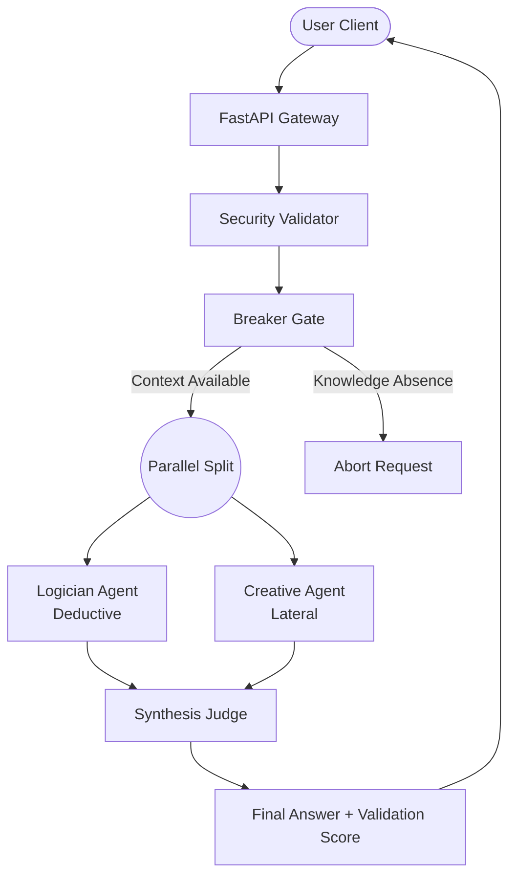

# aetheris Project Bible

> **Single Source of Truth** for the aetheris Adaptive Multi-Model Reasoning Orchestrator.

## 1. Executive Summary

**aetheris** is an advanced multi-agent reasoning orchestrator designed to produce high-quality, validated responses by running multiple AI agents in parallel. It utilizes a **validation-arbitration pipeline**, dynamic runtime prompt layering, and automatic model fallback mechanisms to ensure system resilience and correctness.

The system incorporates the **AETHERIS (Adaptive Multi-Model Reasoning Orchestrator)** architecture, adding multi-turn conversation management, robust security validation, checkpointing, and real-time observability.

---

## 2. Core Architecture & Pipeline

Instead of relying on a single raw model call, aetheris executes a robust four-stage pipeline:

1. **Breaker Gate**: A lightweight pre-filter. If it detects a knowledge absence or lack of context, it aborts the pipeline to save resources.
2. **Logician Agent**: Generates a strictly deductive, logically valid answer.
3. **Creative Agent**: Generates an orthogonal, lateral-thinking answer exploring edge cases and alternatives. Runs in parallel with the Logician.
4. **Synthesis Judge**: Evaluates both the Logician's and Creative's answers for logical consistency, resolves contradictions, and produces a single authoritative response with a validation score.

### High-Level Flow Diagram

---

## 3. System Components & Layers

The AETHERIS architecture is decoupled into distinct, single-responsibility layers:

### Frontend Layer (React / Web UI)
- **ChatWindow**: Handles multi-turn conversational interfaces.
- **ReasoningPanel**: Expandable components to inspect individual agent reasoning and validation scores.
- **TelemetryDrawer**: Real-time metrics visualization.
- *Communication*: Connects to backend via Server-Sent Events (SSE) for low-latency streaming.

### API & Gateway Layer (FastAPI)
- **Endpoints**: Exposes `/query`, `/status`, `/stream`, `/sessions`, `/checkpoints`, `/providers`, and `/telemetry`.
- **Resource Manager**: Enforces rate limiting, token bucket controls, and global concurrency limits.
- **Provider Registry**: Manages provider health, circuit breakers, and automatic fallback chains (e.g., OpenRouter -> Groq -> Local).

### Runtime & Security Layer
- **Execution Passport**: Ties together `request_id`, `session_id`, and `security_metadata` for request tracing.
- **Security Validator**: Provides input escaping, prompt injection detection (e.g., matching "ignore previous instructions"), and secret scrubbing (replacing keys with `[REDACTED]`).

### Orchestration Layer
- **Pipeline Scheduler**: Orchestrates the Normalize -> Breach Check -> Generate -> Evaluate sequence.
- **Decision Engine**: Replaces legacy branching with dynamic parallel gates (Breaker, Logician, Creative, Judge).
- **Conversation Director**: Manages multi-turn history, context tracking, and state transitions. Triggers compression when nearing context limits.

### Knowledge & State Layer
- **Reasoning Graph**: Interlinks facts, verified claims, and edges for epistemic tracking.
- **Checkpoint Manager**: Saves pipeline state at critical junctures (e.g., after normalization). Allows for request resumption via `/checkpoints/{id}/restore`.

---

## 4. API Reference

> [!NOTE]  
> All endpoints expect standard HTTP headers and JSON bodies unless otherwise noted.

| Endpoint | Method | Purpose | Key Parameters/Responses |
|----------|--------|---------|--------------------------|
| `/sessions` | `POST` | Create a new session | Responds with `session_id` and `state` |
| `/sessions/{id}/history` | `GET` | Get conversation history | Returns array of messages with `token_count` |
| `/checkpoints/{id}` | `GET` | List checkpoints | Returns stage, timestamp, and expiration |
| `/checkpoints/{id}/restore`| `POST` | Resume from checkpoint | Responds with resumed stage and status |
| `/providers/health` | `GET` | Monitor provider metrics | Returns error rate, latency, circuit state |
| `/telemetry` | `GET` | Global system metrics | Returns decision, resource, & security metrics |

---

## 5. System Limits & Contracts

### Operational Thresholds
- **Rate Limits**: 100 req/min (per provider), 50 req/min (per user).
- **Concurrency**: Maximum 100 global concurrent requests.
- **Context Window**: 128,000 tokens maximum. Compression triggers at 80% capacity, retaining the 5 most recent turns.
- **Input Constraints**: 10,000 character hard limit per message, strict UTF-8 validation.

### Timeouts & Circuit Breakers
- **Timeouts**: Breaker Gate (100ms), Parallel Agents (30s), Checkpoint Save (5s).
- **Circuit Breaker**: If a provider fails 3 consecutive times, it enters a `CLOSED` (cooldown) state for 60 seconds, and the fallback chain is activated automatically.

---

## 6. Deployment & Rollback Strategy

Deployments follow a phased approach to minimize regression risk:

1. **Phase 1: Core**: `ExecutionPassport` and `SecurityValidator`.
2. **Phase 2: Orchestration**: `ConversationDirector`, `CheckpointManager`, and multi-turn backend tracking.
3. **Phase 3: Knowledge**: `ReasoningGraph` and token-counting heuristics.
4. **Phase 4: Observability**: SSE `StreamingManager` and `RuntimeEngine`.
5. **Phase 5: Integration**: Final pipeline orchestrator logic and background cleanup tasks.

> [!WARNING]  
> **Rollback Procedures**  
> If an alert threshold is breached (e.g., P95 Pipeline Latency > 10,000ms, or Error Rate > 20%), immediately revert the deployment tag, reverse Phase-specific database migrations (like `ReasoningGraph` schema), and flush the active `ProviderPool` metrics.

---

## 7. Operating Modes

aetheris can run in three configurable modes depending on resource availability and budget:

| Mode | Target Models | Best For |
|------|---------------|----------|
| **FREE** | Llama 3, Mistral, Gemma | Zero-cost development, testing, local execution |
| **HYBRID**| Claude 3.5 Sonnet, GPT-4o-mini | Balanced cost/performance, premium models with free fallbacks |
| **PAID** | Claude 3.5 Sonnet, GPT-4o, Llama 3.1 70B | Maximum reasoning accuracy, production environments |
