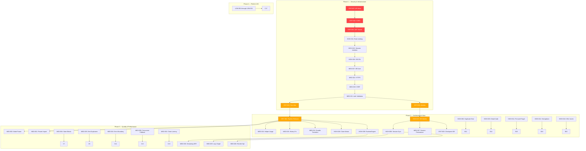

# AETHERIS Repair Manifest v1.0

**Master Repair Document** — Controls all future repair phases.

| Field | Value |
|-------|-------|
| **Document ID** | REPAIR-MANIFEST-v1.0 |
| **Date** | 2026-06-27 |
| **Author** | Chief Software Architect / Principal Systems Engineer / Engineering Release Manager |
| **Source** | Audit reports `docs/audit/00` through `07` |
| **Status** | 🟡 In Review — Not yet active |
| **Total Issues** | 89 |
| **Estimated Duration** | 18 weeks |
| **Target Health Score** | ≥ 88/100 |

---

## Table of Contents

1. [Executive Summary](#1-executive-summary)
2. [Repair Timeline](#2-repair-timeline)
3. [Dependency Graph](#3-dependency-graph)
4. [Subsystem Reports](#4-subsystem-reports)
5. [Repair Phases](#5-repair-phases)
6. [Validation Matrix](#6-validation-matrix)
7. [Rollback Matrix](#7-rollback-matrix)
8. [Risk Matrix](#8-risk-matrix)
9. [Success Criteria](#9-success-criteria)
10. [Overall Repair Roadmap](#10-overall-repair-roadmap)
11. [Version History](#11-version-history)

---

## 1. Executive Summary

### Current State

AETHERIS is an Adaptive Multi-Model Reasoning Orchestrator with **89 known issues** across 12 subsystems. The architecture scores **74/100** with particular weaknesses in test coverage (42/100), dependency management (68/100), and security posture (76/100). Total technical debt is estimated at **6.5/10** — moderate-high.

### Repair Mission

Eliminate all 89 issues across 4 phases over 18 weeks, raising the architecture health score to ≥ 88/100, establishing comprehensive test coverage (≥ 85%), and hardening all security boundaries.

### Guiding Principles

1. **Security before features** — All credential, authentication, and data exposure issues resolved first
2. **Test before refactor** — No architectural change without test coverage
3. **Bottom-up dependency order** — Foundational layers repaired before dependent layers
4. **Risk-prioritized** — Emergency (P0) and Critical (P1) issues before High (P2), Medium (P3), Low (P4)
5. **Six parallel tracks** — Security, Tests, Architecture, Data, Frontend, Performance

### Issue Severity Distribution

| Severity | Count | Percentage | Target Phase |
|----------|-------|------------|-------------|
| Critical | 7 | 7.9% | Phase 1 |
| High | 19 | 21.3% | Phase 2 |
| Medium | 32 | 36.0% | Phase 3 |
| Low | 31 | 34.8% | Phase 4 |
| **Total** | **89** | **100%** | **18 weeks** |

### Target Health Scores After Repair

| Metric | Current | Target | Delta |
|--------|---------|--------|-------|
| Architecture Health | 74/100 | ≥ 88/100 | +14 |
| Code Organization | 80/100 | ≥ 90/100 | +10 |
| Separation of Concerns | 72/100 | ≥ 85/100 | +13 |
| Dependency Management | 68/100 | ≥ 85/100 | +17 |
| Test Coverage | 42/100 | ≥ 85/100 | +43 |
| Documentation | 83/100 | ≥ 90/100 | +7 |
| Security Posture | 76/100 | ≥ 92/100 | +16 |
| Error Handling | 78/100 | ≥ 90/100 | +12 |
| Extensibility | 70/100 | ≥ 85/100 | +15 |

---

## 2. Repair Timeline

### Master Timeline (18 Weeks)

```
Week    0    1    2    3    4    5    6    7    8    9    10   11   12   13   14   15   16   17   18
        │    │    │    │    │    │    │    │    │    │    │    │    │    │    │    │    │    │    │
Phase 1 ████████████████░░░░░░░░░░░░░░░░░░░░░░░░░░░░░░░░░░░░░░░░░░░░░░░░░░░░░░░░░░░░░░░░░░░░░░░░
Phase 2 ░░░░░░░░░░████████████████████████████████░░░░░░░░░░░░░░░░░░░░░░░░░░░░░░░░░░░░░░░░░░░░
Phase 3 ░░░░░░░░░░░░░░░░░░░░░░░░░░░░████████████████████████████████░░░░░░░░░░░░░░░░░░░░░░░░░░
Phase 4 ░░░░░░░░░░░░░░░░░░░░░░░░░░░░░░░░░░░░░░░░░░░░░░░░░░░░░░░░████████████████████████████████
        │    │    │    │    │    │    │    │    │    │    │    │    │    │    │    │    │    │    │
Track A ████████████████░░░░░░░░░░░░░░░░░░░░░░░░░░░░░░░░░░░░░░░░░░░░░░░░░░░░░░░░░░░░░░░░░░░░░░
Track B ░░████████████████████████████████████████████░░░░░░░░░░░░░░░░░░░░░░░░░░░░░░░░░░░░░░░░
Track C ░░░░░░░░░░░░████████████████████████████░░░░░░░░░░░░░░░░░░░░░░░░░░░░░░░░░░░░░░░░░░░░░
Track D ░░░░░░░░░░░░░░░░██████████████████████████████████░░░░░░░░░░░░░░░░░░░░░░░░░░░░░░░░░░░
Track E ░░░░░░░░░░░░░░░░░░░░░░░░░░░░░░░░░░████████████████████████░░░░░░░░░░░░░░░░░░░░░░░░░░
Track F ░░░░░░░░░░░░░░░░░░░░░░░░░░░░░░░░░░░░░░░░░░░░░░████████████████████████░░░░░░░░░░░░░░
```

### Track Definitions

| Track | Focus | Weeks | Lead Subsystems |
|-------|-------|-------|-----------------|
| **A — Security** | Emergency credential rotation, CORS, JWT, SSL, rate limiting | 0-2 | Security, Authentication, Database |
| **B — Tests** | Test infrastructure, core component tests, CI integration | 1-12 | All subsystems |
| **C — Architecture** | Pipeline consolidation, dead code removal, RuntimeEngine integration | 3-8 | Pipeline, Runtime |
| **D — Data** | Alembic migrations, DB models, session/checkpoint persistence | 4-10 | Database, Providers |
| **E — Frontend** | Auth cookie migration, session sync, error boundary, rendering optimization | 8-14 | Frontend, Mission Control, Streaming |
| **F — Performance** | Prompt caching, claim disable, concurrent fallback, token reduction | 10-18 | Performance, Prompt System |

### Key Milestones

| Milestone | Week | Deliverable | Criteria |
|-----------|------|-------------|----------|
| M1 — Secure Foundation | 2 | No live credentials, CORS/JWT/SSL hardened | All P0 issues closed |
| M2 — Testable Architecture | 4 | Test infra + 110+ core tests | CI pipeline operational |
| M3 — Clean Pipeline | 8 | Single execution path, RuntimeEngine active, DB models live | No dead code; all P1-P2 core issues closed |
| M4 — Quality & Performance | 14 | 29 MED issues closed, concurrent fallback, optimized rendering | All MED closed |
| M5 — Production Ready | 18 | 31 LOW closed, 400+ tests, 85%+ coverage | All 89 issues closed |

---

## 3. Dependency Graph

### Master Dependency Graph



### Simplified Repair Path

```
Emergency (Week 0)         Foundation (Week 1-2)        Core (Week 3-8)
─────────────────          ──────────────────           ──────────────────
Rotate Keys ─────────→     Alembic ────────────→        DB Models ──────────→
Fix CORS                  Test Infrastructure          Pipeline Refactor ───→
Harden JWT                Rate Limiting                Session Persistence ─→
DB SSL                    Session Isolation            RuntimeEngine Active
HTTPS                     Auth Validation              Dead Code Removed
CSRF                      Restricted DB User           

Quality (Week 9-14)       Polish (Week 15-18)
─────────────────          ──────────────────
Streaming DRY             Accessibility
Concurrent Fallback       Documentation
Error Boundary            Logging
Render Optimization       Async I/O Fix
Token Waste Reduction     Config Cleanup
```

### Independent Parallel Workstreams

The following issue groups have **no cross-dependencies** and can be repaired in parallel:

| Group | Issues | Common Theme |
|-------|--------|-------------|
| **Security-independent** | CRIT-004, CRIT-005, CRIT-007, HIGH-014, HIGH-016, MED-019, MED-021, MED-022, MED-027 | No code changes needed; config/env only |
| **Dead code cleanup** | HIGH-002, HIGH-003, HIGH-006, HIGH-007, LOW-005 | Safe to remove; no runtime impact |
| **Simple fixes** | HIGH-004, HIGH-005, HIGH-010, HIGH-018, LOW-001, LOW-006, LOW-007, LOW-008 | Trivial changes; no regressions |
| **Frontend-only** | HIGH-013, MED-020, MED-024, MED-028, MED-029, LOW-020 through LOW-025, LOW-030, LOW-031 | No backend changes needed |
| **Performance-only** | HIGH-019, MED-003, MED-005, MED-030, MED-031, MED-032, LOW-011, LOW-029 | Can be optimized independently |

### Blocked Issues (Must Wait)

| Issue | Blocked By | Unblocked When |
|-------|-----------|----------------|
| CRIT-001 (Pipeline refactor) | CRIT-002 (Tests) | Test infrastructure complete (Week 2) |
| HIGH-008 (Session sync) | HIGH-017 (DB models), MED-007 (DB sessions) | DB models deployed (Week 5) |
| CRIT-003 (Checkpoint DB) | HIGH-017 (DB models) | DB models deployed (Week 5) |
| HIGH-009 (RuntimeEngine) | CRIT-001 (Pipeline path settled) | Pipeline refactored (Week 8) |
| MED-023 (RBAC) | CRIT-005 (JWT hardened) | JWT secret validated (Week 1) |

### High-Risk Repairs

| Issue | Risk Level | Reason | Mitigation |
|-------|-----------|--------|------------|
| CRIT-001 | 🔴 High | Core pipeline 1152 lines; behavioral change | Keep both paths for 1 sprint; A/B test results |
| HIGH-013 | 🔴 High | Auth token storage change breaks all sessions | Keep localStorage fallback for 1 release |
| HIGH-008 | 🔴 High | Frontend-backend session divergence; data migration | Beta flag; localStorage import script |
| CRIT-003 | 🟡 Medium | Checkpoint backend switch; data survival test | Test with mocked checkpoints first |
| HIGH-009 | 🟡 Medium | New wrapper layer around all provider calls | RuntimeEngine was designed for integration; benchmark before/after |

---

## 4. Subsystem Reports

Each subsystem includes: health score, issue count, estimated repair time, risk level, dependencies, blocking issues, and files affected.

---

### Subsystem S1 — Pipeline

**Core file:** `orchestrator/pipelines.py` (1152 lines)
**Assessment:** ⚠️ Overloaded — dual execution paths, monolithic

| Metric | Value |
|--------|-------|
| **Health Score** | 55/100 |
| **Issues** | 12 total: 1 Critical, 2 High, 6 Medium, 3 Low |
| **Estimated Repair Time** | 5 weeks |
| **Risk Level** | 🔴 High |
| **Dependencies** | Runtime, Providers, Prompt System |
| **Blocking Issues** | None (pipeline blocks other subsystems) |

| Issue ID | Severity | Summary |
|----------|----------|---------|
| CRIT-001 | Critical | Dual execution paths (legacy + DecisionEngine) |
| HIGH-004 | High | Private method access `pool._get_state()` |
| HIGH-019 | High | Claim extraction runs a no-op validation on every request |
| MED-002 | Medium | Mode parameter not passed to stream pipeline |
| MED-004 | Medium | 8+ identical try/except blocks for state transitions |
| MED-014 | Medium | Double conversation state transition |
| MED-015 | Medium | User query never added to history |
| MED-016 | Medium | `transition_conversation_to_failed` helper exists but unused |
| LOW-003 | Low | `score_a` / `score_b` both set to same value |
| LOW-016 | Low | Confidence round-trip precision loss |
| LOW-018 | Low | Missing structured logging |
| LOW-025 | Low | Stage notification race in frontend |

**Files affected:** `orchestrator/pipelines.py`, `orchestrator/decisions.py`, `orchestrator/evaluation.py`, `agents/prompt_utils.py`, `core/error_handlers.py`

---

### Subsystem S2 — Runtime

**Core file:** `core/runtime.py` (614 lines)
**Assessment:** 🔴 Well-designed dead code — 270-line method never called

| Metric | Value |
|--------|-------|
| **Health Score** | 35/100 |
| **Issues** | 3 total: 1 High, 2 Medium |
| **Estimated Repair Time** | 2 weeks |
| **Risk Level** | 🟡 Medium |
| **Dependencies** | Pipeline (must be settled first), Providers |
| **Blocking Issues** | None (RuntimeEngine is not blocking anything) |

| Issue ID | Severity | Summary |
|----------|----------|---------|
| HIGH-009 | High | `execute_with_contracts` never called by pipeline code |
| MED-003 | Medium | Duplicate streaming import/emit patterns (6+ blocks) |
| MED-011 | Medium | DI bypass — creates own AsyncHTTPClient |

**Files affected:** `core/runtime.py`, `api_gateway/rate_limiter.py`, `orchestrator/pipelines.py`

---

### Subsystem S3 — Prompt System

**Core files:** `agents/prompt_manager.py` (338 lines), `agents/personas.py` (230 lines), `prompts/` (25 XML files)
**Assessment:** ✅ Good architecture with performance and fallback issues

| Metric | Value |
|--------|-------|
| **Health Score** | 72/100 |
| **Issues** | 11 total: 1 High, 10 Low |
| **Estimated Repair Time** | 1 week |
| **Risk Level** | 🟢 Low |
| **Dependencies** | None |
| **Blocking Issues** | None |

| Issue ID | Severity | Summary |
|----------|----------|---------|
| HIGH-006 | High | Unused VERIFIER_PROMPT and SKEPTIC_PROMPT |
| HIGH-018 | High | No caching — 48 file I/O ops per request |
| LOW-011 | Low | Runtime contracts loaded from disk every time |
| LOW-012 | Low | Synthesizer fallback key produces "synthesizer" — no registry match |
| LOW-013 | Low | 9 of 13 system prompt XML files never loaded |
| LOW-014 | Low | XML validator checks well-formedness only |
| LOW-017 | Low | `get_load_order_verification` never called at startup |
| LOW-019 | Low | Breaker receives all 12 runtime contracts (heavy context) |
| LOW-029 | Low | Synchronous file I/O blocks asyncio event loop |
| PRM-001 | Low | Synthesizer fallback key mismatch (from Prompt Runtime Audit) |
| PRM-003 | Low | Runtime contract loading not cached |

**Files affected:** `agents/prompt_manager.py`, `agents/personas.py`, `agents/prompt_utils.py`, `agents/parser.py`, `prompts/runtime/*.xml`, `prompts/system/*.xml`

---

### Subsystem S4 — Providers

**Core files:** `api_gateway/rate_limiter.py` (990 lines), `api_gateway/client.py` (173 lines), `api_gateway/strategy.py` (241 lines)
**Assessment:** ⚠️ 4 classes in one file; hardcoded strategy maps

| Metric | Value |
|--------|-------|
| **Health Score** | 68/100 |
| **Issues** | 7 total: 2 High, 5 Medium |
| **Estimated Repair Time** | 3 weeks |
| **Risk Level** | 🟡 Medium |
| **Dependencies** | Pipeline |
| **Blocking Issues** | None |

| Issue ID | Severity | Summary |
|----------|----------|---------|
| HIGH-011 | High | Fire-and-forget streaming tasks (4 locations) |
| HIGH-012 | High | Semaphore bug — releases before acquire |
| MED-011 | Medium | DI bypass — creates own AsyncHTTPClient |
| MED-017 | Medium | Instruction reinforcement has wrong schema for Judge |
| MED-030 | Medium | Sequential fallback adds latency |
| MED-031 | Medium | Instruction reinforcement wastes 320-480 tokens/request |
| MED-032 | Medium | Sequential model chain latency (30s+ per degraded provider) |
| LOW-009 | Low | HTTP client pool never closed |

**Files affected:** `api_gateway/rate_limiter.py`, `api_gateway/client.py`, `api_gateway/strategy.py`

---

### Subsystem S5 — Authentication

**Core files:** `core/security.py` (367 lines), `server.py` (auth routes 265-303)
**Assessment:** 🟡 JWT hardening, rate limiting, and input validation needed

| Metric | Value |
|--------|-------|
| **Health Score** | 60/100 |
| **Issues** | 10 total: 3 Critical, 3 High, 4 Medium |
| **Estimated Repair Time** | 3 weeks |
| **Risk Level** | 🔴 High |
| **Dependencies** | Database |
| **Blocking Issues** | None (blocks session isolation) |

| Issue ID | Severity | Summary |
|----------|----------|---------|
| CRIT-005 | Critical | Hardcoded default JWT secret |
| CRIT-004 | Critical | CORS wildcard with credentials |
| HIGH-002 | High | Duplicate SecurityValidationError |
| HIGH-014 | High | No rate limiting on auth endpoints |
| HIGH-015 | High | No session/user isolation |
| MED-019 | Medium | No CSRF protection |
| MED-020 | Medium | Token refresh dead code |
| MED-021 | Medium | No input validation on registration |
| MED-022 | Medium | No HTTPS/TLS configuration |
| MED-023 | Medium | No role-based access control |

**Files affected:** `core/security.py`, `core/config.py`, `core/error_handlers.py`, `server.py`, `aetheris-ui/src/utils/auth.js`, `aetheris-ui/src/api/client.js`

---

### Subsystem S6 — Database

**Core files:** `core/database.py` (60 lines), `core/models.py` (30 lines)
**Assessment:** 🔴 Single model, no migrations, no SSL, superuser credentials

| Metric | Value |
|--------|-------|
| **Health Score** | 30/100 |
| **Issues** | 9 total: 1 Critical, 2 High, 3 Medium, 3 Low |
| **Estimated Repair Time** | 4 weeks |
| **Risk Level** | 🟡 Medium |
| **Dependencies** | None |
| **Blocking Issues** | None (blocks DB models → sessions → checkpoints) |

| Issue ID | Severity | Summary |
|----------|----------|---------|
| CRIT-006 | Critical | No Alembic migration system |
| HIGH-016 | High | SSL disabled for database connections |
| HIGH-017 | High | Only one database model (User) |
| MED-025 | Medium | No connection recycling (`pool_recycle`) |
| MED-026 | Medium | No user cache — every API call queries DB |
| MED-027 | Medium | Superuser credentials (no password) |
| LOW-026 | Low | No connection pool monitoring |
| LOW-027 | Low | No soft-delete for User model |
| LOW-028 | Low | SSE streaming holds DB connection for stream duration |

**Files affected:** `core/database.py`, `core/models.py`, `core/config.py`, `core/security.py`, `server.py`, `.env`

---

### Subsystem S7 — Streaming

**Core file:** `orchestrator/streaming.py` (343 lines)
**Assessment:** ✅ Functional but with datetime, duplicate, and sync issues

| Metric | Value |
|--------|-------|
| **Health Score** | 72/100 |
| **Issues** | 4 total: 1 High, 2 Medium, 1 Low |
| **Estimated Repair Time** | 1 week |
| **Risk Level** | 🟢 Low |
| **Dependencies** | Pipeline |
| **Blocking Issues** | None |

| Issue ID | Severity | Summary |
|----------|----------|---------|
| HIGH-010 | High | `datetime.utcnow()` (naive) instead of timezone-aware |
| MED-005 | Medium | Duplicate emit methods (`emit`, `emit_raw`) |
| MED-012 | Medium | Fire-and-forget streaming tasks |
| LOW-010 | Low | Dict accesses lack synchronization |

**Files affected:** `orchestrator/streaming.py`, `orchestrator/decisions.py`

---

### Subsystem S8 — Frontend

**Core files:** `aetheris-ui/src/` (36 JS/JSX modules, ~4100 lines)
**Assessment:** ⚠️ Well-structured components; XSS-vulnerable token storage, performance issues

| Metric | Value |
|--------|-------|
| **Health Score** | 68/100 |
| **Issues** | 17 total: 1 High, 7 Medium, 9 Low |
| **Estimated Repair Time** | 6 weeks |
| **Risk Level** | 🔴 High (auth migration) |
| **Dependencies** | Authentication (token storage), Database (session sync) |
| **Blocking Issues** | HIGH-008, HIGH-013 |

| Issue ID | Severity | Summary |
|----------|----------|---------|
| HIGH-008 | High | Session state divergence (localStorage vs backend) |
| HIGH-013 | High | JWT stored in localStorage (XSS-vulnerable) |
| MED-008 | Medium | Duplicate login pages |
| MED-020 | Medium | Token refresh dead code |
| MED-024 | Medium | No React error boundary |
| MED-028 | Medium | Full re-render during streaming |
| MED-029 | Medium | Graph/Timeline computed when not visible |
| LOW-008 | Low | Hardcoded health poll and timeout constants |
| LOW-020 | Low | `buildGraphData` runs even when graph hidden |
| LOW-021 | Low | SSE buffer no size limit |
| LOW-022 | Low | Mission Control tabs lack keyboard navigation |
| LOW-023 | Low | No heading hierarchy |
| LOW-024 | Low | CSS reduced-motion incomplete |
| LOW-030 | Low | Unbounded SSE buffer (duplicate) |
| LOW-031 | Low | All Mission Control tabs rendered simultaneously |

**Files affected:** `aetheris-ui/src/App.jsx`, `aetheris-ui/src/utils/auth.js`, `aetheris-ui/src/api/client.js`, `aetheris-ui/src/store/useChatStore.js`, `aetheris-ui/src/components/MissionControlPanel.jsx`, `aetheris-ui/src/index.css`, `aetheris_login.html`, `aetheris-ui/public/login.html`

---

### Subsystem S9 — Mission Control

**Core file:** `aetheris-ui/src/components/MissionControlPanel.jsx` (401 lines)
**Assessment:** ⚠️ Feature-rich but heavy — all tabs rendered, no keyboard nav, no lazy computation

| Metric | Value |
|--------|-------|
| **Health Score** | 65/100 |
| **Issues** | 3 total: 3 Low |
| **Estimated Repair Time** | 1 week |
| **Risk Level** | 🟢 Low |
| **Dependencies** | Frontend |
| **Blocking Issues** | None |

| Issue ID | Severity | Summary |
|----------|----------|---------|
| LOW-022 | Low | No keyboard arrow navigation in tabs |
| LOW-031 | Low | All tabs rendered simultaneously |
| MED-029 | Medium | Graph/Timeline data computed when panel closed |

**Files affected:** `aetheris-ui/src/components/MissionControlPanel.jsx`, `aetheris-ui/src/App.jsx`

---

### Subsystem S10 — Security

**Core files:** `core/security.py` (367 lines), `server.py` (CORS, middleware)
**Assessment:** 🟡 Good validator; critical CORS, JWT, and credential issues

| Metric | Value |
|--------|-------|
| **Health Score** | 55/100 |
| **Issues** | 6 total: 3 Critical, 1 High, 2 Medium |
| **Estimated Repair Time** | 1 week |
| **Risk Level** | 🔴 High |
| **Dependencies** | None (independent) |
| **Blocking Issues** | None (blocks other subsystems) |

| Issue ID | Severity | Summary |
|----------|----------|---------|
| CRIT-004 | Critical | CORS wildcard with credentials |
| CRIT-005 | Critical | Hardcoded JWT secret |
| CRIT-007 | Critical | API keys committed |
| HIGH-016 | High | Database SSL disabled |
| MED-019 | Medium | No CSRF protection |
| MED-021 | Medium | No input validation on registration |

**Files affected:** `core/security.py`, `core/config.py`, `server.py`, `.env`

---

### Subsystem S11 — Performance

**Cross-cutting concerns:** Token waste, CPU waste, latency, memory
**Assessment:** ⚠️ Significant waste from uncached I/O, no-op processing, sequential fallback

| Metric | Value |
|--------|-------|
| **Health Score** | 58/100 |
| **Issues** | 9 total: 2 High, 7 Medium |
| **Estimated Repair Time** | 4 weeks |
| **Risk Level** | 🟡 Medium |
| **Dependencies** | Pipeline, Providers, Prompt System |
| **Blocking Issues** | None (optimization-only) |

| Issue ID | Severity | Summary |
|----------|----------|---------|
| HIGH-018 | High | XML prompt loading uncached (20-80ms/request) |
| HIGH-019 | High | Claim extraction no-op (50-200ms/request) |
| MED-003 | Medium | Duplicate streaming emit patterns |
| MED-030 | Medium | Sequential fallback latency |
| MED-031 | Medium | Instruction reinforcement token waste |
| MED-032 | Medium | Sequential model chain latency |
| LOW-011 | Low | Runtime contracts loaded every request |
| LOW-019 | Low | Breaker gets full heavy context |
| LOW-029 | Low | Sync I/O blocks event loop |

**Files affected:** `agents/prompt_manager.py`, `orchestrator/pipelines.py`, `orchestrator/claims.py`, `api_gateway/rate_limiter.py`, `api_gateway/client.py`, `orchestrator/streaming.py`, `core/runtime.py`

---

### Subsystem S12 — Documentation

**Core files:** `docs/` directory (7 Markdown files)
**Assessment:** ✅ Well-documented with minor drift

| Metric | Value |
|--------|-------|
| **Health Score** | 83/100 |
| **Issues** | 1 total: 1 Low |
| **Estimated Repair Time** | 1 day |
| **Risk Level** | 🟢 Low |
| **Dependencies** | All subsystems (documentation must reflect final state) |
| **Blocking Issues** | None |

| Issue ID | Severity | Summary |
|----------|----------|---------|
| LOW-006 | Low | README references old `web/` directory |

**Files affected:** `README.md`, `docs/aetheris_architecture.md`, `docs/deployment.md`, `CHANGELOG.md`

---

### Subsystem S13 — Developer Experience

**Cross-cutting concerns:** Testing, logging, observability, configuration
**Assessment:** 🔴 Poor test coverage; missing structured logging; no configuration validation

| Metric | Value |
|--------|-------|
| **Health Score** | 45/100 |
| **Issues** | 5 total: 1 Critical, 1 Medium, 3 Low |
| **Estimated Repair Time** | 3 weeks |
| **Risk Level** | 🟡 Medium |
| **Dependencies** | All subsystems |
| **Blocking Issues** | None |

| Issue ID | Severity | Summary |
|----------|----------|---------|
| CRIT-002 | Critical | No automated tests for orchestration logic |
| MED-018 | Medium | No provider health metrics endpoint |
| LOW-001 | Low | Telemetry uses `print()` |
| LOW-007 | Low | `register_hook` no callable validation |
| LOW-017 | Low | `get_load_order_verification` never called at startup |
| LOW-026 | Low | No connection pool monitoring |
| LOW-018 | Low | Missing structured logging |

**Files affected:** New `tests/` directory, `telemetry/observer.py`, `orchestrator/state_machine.py`, `agents/prompt_manager.py`, `core/database.py`, `server.py`

---

### Subsystem Summary Table

| # | Subsystem | Files | Issues | C | H | M | L | Repair Time | Risk |
|---|-----------|-------|--------|---|---|---|---|-------------|------|
| S1 | Pipeline | 4+.py | 12 | 1 | 2 | 6 | 3 | 5 wk | 🔴 High |
| S2 | Runtime | 3+.py | 3 | 0 | 1 | 2 | 0 | 2 wk | 🟡 Med |
| S3 | Prompt System | 4+.py + 25 XML | 11 | 0 | 2 | 0 | 9 | 1 wk | 🟢 Low |
| S4 | Providers | 3.py | 7 | 0 | 2 | 5 | 0 | 3 wk | 🟡 Med |
| S5 | Authentication | 4+.py + 2.js | 10 | 3 | 3 | 4 | 0 | 3 wk | 🔴 High |
| S6 | Database | 3.py + .env | 9 | 1 | 2 | 3 | 3 | 4 wk | 🟡 Med |
| S7 | Streaming | 2.py | 4 | 0 | 1 | 2 | 1 | 1 wk | 🟢 Low |
| S8 | Frontend | 36.js/jsx | 17 | 0 | 2 | 7 | 8 | 6 wk | 🔴 High |
| S9 | Mission Control | 2.jsx | 3 | 0 | 0 | 1 | 2 | 1 wk | 🟢 Low |
| S10 | Security | 3.py + .env | 6 | 3 | 1 | 2 | 0 | 1 wk | 🔴 High |
| S11 | Performance | 7+.py + 2.js | 9 | 0 | 2 | 6 | 1 | 4 wk | 🟡 Med |
| S12 | Documentation | 7.md | 1 | 0 | 0 | 0 | 1 | 1 d | 🟢 Low |
| S13 | Developer Exp. | New + 5+.existing | 6 | 1 | 0 | 1 | 4 | 3 wk | 🟡 Med |

---

## 5. Repair Phases

### Phase 1 — Core Stabilization (Weeks 0-2)

**Theme:** Stop active harm. Eliminate emergency security vulnerabilities. Establish foundational infrastructure.

**Subsystems targeted:** Security, Authentication, Database, Developer Experience

**Issues resolved:** 12 (7 Critical + 5 High/Medium promoted from severity)

**Ordered repair sequence:**

```
Week 0                                 Week 1                                  Week 2
─────                                  ─────                                   ─────
CRIT-007  Rotate API Keys              CRIT-006  Initialize Alembic             HIGH-015  Session isolation
CRIT-004  Fix CORS                     CRIT-002  Test infrastructure            MED-021   Auth validation
CRIT-005  Harden JWT secret             HIGH-014  Auth rate limiting            MED-019   CSRF protection
HIGH-016  Database SSL config           MED-027   Restricted DB user
MED-022   HTTPS/TLS config              HIGH-015  Session isolation (start)
```

**Repair Graph for Phase 1:**

```
Parallel Independent:         Sequential Dependent:
CRIT-007 ───────────┐        CRIT-005 → HIGH-014 → HIGH-015
CRIT-004 ───────────┤        CRIT-006 → CRIT-002
HIGH-016 ───────────┤
MED-022 ────────────┤
MED-027 ────────────┘
```

**Validation checkpoint (end of Phase 1):**
- [ ] No live API keys in `.env`
- [ ] CORS origins explicitly configured
- [ ] JWT secret validated at startup; default rejected
- [ ] Database SSL configurable via env var
- [ ] Auth endpoints rate-limited (5/min per IP)
- [ ] Alembic migration chain operational
- [ ] Test infrastructure with 20+ tests passing
- [ ] HTTPS/TLS documented and configurable
- [ ] CSRF middleware installed
- [ ] Auth input validation enforced

---

### Phase 2 — Platform Completion (Weeks 3-8)

**Theme:** Architecture stabilization. Eliminate dead code, consolidate dual paths, establish data persistence.

**Subsystems targeted:** Pipeline, Runtime, Database, Providers, Prompt System

**Issues resolved:** 17 (all HIGH severity)

**Ordered repair sequence:**

```
Week 3-4                              Week 5-6                               Week 7-8
────────                              ───────                                ───────
HIGH-002  Delete duplicate error      HIGH-017  DB models + migrations        HIGH-008  Session sync (backend)
HIGH-003  Remove pipeline_scheduler   CRIT-003  Checkpoint DB backend         HIGH-009  RuntimeEngine integration
HIGH-004  Fix private method access   MED-007   DB session persistence        HIGH-013  JWT cookie migration
HIGH-005  Remove PostgreSQL restart   MED-020   Token refresh implementation  MED-023   RBAC implementation
HIGH-006  Clean unused prompts        HIGH-018  XML prompt caching            HIGH-019  Disable claim extraction
HIGH-007  Remove SignalState
HIGH-011  Fix fire-and-forget tasks
HIGH-012  Fix semaphore bug
MED-012   Streaming task handlers
MED-013   Semaphore fix (concurrent)
CRIT-001  Pipeline refactor (start)
```

**Repair Graph for Phase 2:**

```
       ┌─────────────────────────────────────────────────────────┐
       │                    CRIT-006 (Alembic)                    │
       └─────────────────────────┬───────────────────────────────┘
                                 │
                        HIGH-017 (DB Models)
                        ┌───────┴───────┐
                        │               │
                 CRIT-003          MED-007
              (Checkpoint DB)   (Session Persist)
                        │               │
                        └───────┬───────┘
                                │
                         HIGH-008 (Session Sync)

HIGH-002 ─→ HIGH-003 ─→ HIGH-006 ─→ HIGH-007   (Dead code cleanup chain)
HIGH-011 ─→ MED-012                              (Streaming tasks)
HIGH-012 ─→ MED-013                              (Semaphore fix)
HIGH-005 ─→ HIGH-004                             (Gateway cleanup)

CRIT-002 (Tests) → CRIT-001 (Pipeline refactor) → HIGH-009 (RuntimeEngine)
```

**Validation checkpoint (end of Phase 2):**
- [ ] Single pipeline execution path (legacy removed)
- [ ] All dead code modules removed
- [ ] DB models active for sessions, messages, checkpoints
- [ ] Alembic migrations for all models
- [ ] Checkpoints survive restart
- [ ] Sessions survive restart
- [ ] RuntimeEngine enforcing contracts
- [ ] XML prompt caching active (48x I/O reduction)
- [ ] JWT stored in httpOnly cookies
- [ ] Token refresh mechanism operational
- [ ] RBAC active (admin/user roles)
- [ ] All fire-and-forget tasks have error handlers
- [ ] Semaphore correctly limits to 100 concurrent

---

### Phase 3 — Quality & Performance (Weeks 9-14)

**Theme:** DRY codebase, performance optimization, UI hardening.

**Subsystems targeted:** Frontend, Mission Control, Streaming, Performance, Prompt System

**Issues resolved:** 29 (all MED severity)

**Ordered repair sequence:**

```
Week 9-10 (Code Quality)         Week 11-12 (UI Hardening)        Week 13-14 (Performance)
─────────────────────            ─────────────────────            ──────────────────────
MED-016  Use transition helper   MED-024  React error boundary    MED-030  Concurrent fallback
MED-004  Replace all 7+ blocks   MED-008  Consolidate login pages MED-032  Model chain opt
MED-014  Fix double transition   MED-028  Streaming render opt    MED-031  Token waste reduction
MED-015  Add user query history  MED-029  Lazy graph/timeline     MED-017  Schema-correct reminder
MED-003  DRY streaming emit      MED-001  Fix private import      MED-025  pool_recycle
MED-005  Consolidate emit        MED-002  Plumb mode param        MED-026  User cache
MED-010  Deduplicate field map   MED-011  Constructor injection   MED-009  Real embeddings
                                 MED-006  Claim validation        MED-018  Health endpoint
```

**Repair Graph for Phase 3:**

```
MED-016 → MED-004 → MED-014 → MED-015     (Conversation state chain)
MED-003 → MED-005                          (Streaming DRY chain)
MED-017 → MED-031                          (Instruction message chain)
MED-030 → MED-032                          (Fallback performance chain)
MED-024 (Error boundary — independent)
MED-028 → MED-029                          (Render optimization chain)
MED-025 → MED-026                          (Database tuning chain)
```

**Validation checkpoint (end of Phase 3):**
- [ ] No duplicate conversation state blocks remaining
- [ ] Single streaming emit path
- [ ] User query recorded in history
- [ ] React error boundary catching render errors
- [ ] Streaming re-renders optimized (sidebar/input stable)
- [ ] Graph/timeline data lazily computed
- [ ] Concurrent fallback active for providers
- [ ] Token waste reduced by 75%+
- [ ] `pool_recycle=3600` configured
- [ ] User record caching active
- [ ] Claim validation either implemented or disabled
- [ ] Provider health endpoint active

---

### Phase 4 — Polish & DX (Weeks 15-18)

**Theme:** Accessibility, documentation, observability, developer experience.

**Subsystems targeted:** Frontend, Documentation, Developer Experience, all subsystems for logging

**Issues resolved:** 31 (all LOW severity)

**Ordered repair sequence:**

```
Week 15 (Quick Wins)             Week 16 (Frontend Polish)        Week 17-18 (Developer Exp.)
─────────────────────            ─────────────────────            ────────────────────────
LOW-001  Replace print()         LOW-020  Lazy graph build        LOW-014  XML structural validation
LOW-005  Delete stale .pyc       LOW-021  SSE buffer limit        LOW-015  Judge history param
LOW-006  Fix README structure    LOW-022  Keyboard tab nav        LOW-018  Structured logging
LOW-007  Hook type validation    LOW-023  Heading hierarchy       LOW-019  Role-specific contracts
LOW-008  Environment var consts  LOW-024  Reduced motion CSS      LOW-026  Pool metrics monitor
LOW-012  Fix fallback key        LOW-025  Notification race fix   LOW-027  Soft-delete User
LOW-013  Archive unused prompts  LOW-030  SSE buffer defense      LOW-028  SSE DB session release
LOW-017  Startup verification    LOW-031  Lazy tab rendering      LOW-029  Async executor
LOW-003  Score naming
LOW-004  Public API access
LOW-009  HTTP client lifecycle
LOW-011  LRU cache for contracts
```

**Repair Graph for Phase 4:**

```
(No blocking dependencies — all LOW issues are independent)
All LOW issues can be fixed in any order within Phase 4.
```

**Validation checkpoint (end of Phase 4):**
- [ ] All `print()` calls replaced with logger
- [ ] Documentation updated (README, architecture docs)
- [ ] Keyboard navigation works in all components
- [ ] CSS animations respect reduced motion
- [ ] Structured logging with request_id in all modules
- [ ] Database pool metrics logged periodically
- [ ] SSE streams release DB connections
- [ ] Async I/O in thread pool executors
- [ ] All 31 LOW issues closed

---

## 6. Validation Matrix

### Per-Subsystem Validation Requirements

| # | Subsystem | Compile | Static Analysis | Type Check | Unit Tests | Integration | Regression | Performance | Security | UI | Manual |
|---|-----------|---------|----------------|------------|------------|-------------|------------|-------------|----------|--------|--------|
| S1 | Pipeline | ✅ | ✅ | ✅ | 40+ | 10+ | ✅ | ✅ | — | — | ✅ |
| S2 | Runtime | ✅ | ✅ | ✅ | 20+ | 5+ | ✅ | ✅ | — | — | ✅ |
| S3 | Prompt System | ✅ | ✅ | — | 15+ | 3+ | ✅ | ✅ | ✅ | — | ✅ |
| S4 | Providers | ✅ | ✅ | ✅ | 30+ | 10+ | ✅ | ✅ | — | — | ✅ |
| S5 | Authentication | ✅ | ✅ | ✅ | 25+ | 10+ | ✅ | — | ✅ | ✅ | ✅ |
| S6 | Database | ✅ | ✅ | ✅ | 20+ | 10+ | ✅ | ✅ | ✅ | — | ✅ |
| S7 | Streaming | ✅ | ✅ | ✅ | 20+ | 5+ | ✅ | ✅ | — | — | ✅ |
| S8 | Frontend | ✅ | ✅ | ✅ | 30+ | 10+ | ✅ | ✅ | ✅ | ✅ | ✅ |
| S9 | Mission Control | ✅ | ✅ | ✅ | 10+ | 5+ | ✅ | ✅ | — | ✅ | ✅ |
| S10 | Security | ✅ | ✅ | ✅ | 30+ | 10+ | ✅ | — | ✅ | ✅ | ✅ |
| S11 | Performance | ✅ | ✅ | — | 15+ | 5+ | ✅ | ✅ | — | — | ✅ |
| S12 | Documentation | — | — | — | — | — | — | — | — | — | ✅ |
| S13 | Developer Exp. | ✅ | ✅ | — | 10+ | — | ✅ | — | — | — | ✅ |

### Validation Tool Requirements

| Tool | Used For | Config File | Status |
|------|----------|-------------|--------|
| `pytest` | Python unit/integration tests | `pytest.ini` | 🆕 Needs creation |
| `ruff` | Python linting/formatting | `pyproject.toml` | 🆕 Needs creation |
| `mypy` | Python type checking | `pyproject.toml` | 🆕 Needs creation |
| `vitest` | Frontend tests | `vitest.config.js` | ✅ Already configured |
| `eslint` | Frontend linting | — | 🆕 Needs creation |
| `pa11y` | Accessibility testing | — | 🆕 Needs creation |
| `locust` | Load/performance testing | — | 🆕 Needs creation |

### Cumulative Test Targets by Phase

| Phase | Unit Tests | Integration Tests | Performance Tests | Security Tests | Total |
|-------|------------|-------------------|-------------------|----------------|-------|
| Phase 1 | 30 | 5 | 0 | 5 | 40 |
| Phase 2 | 180 | 25 | 5 | 10 | 220 |
| Phase 3 | 100 | 15 | 10 | 5 | 130 |
| Phase 4 | 40 | 5 | 0 | 0 | 45 |
| **Final** | **350** | **50** | **15** | **20** | **435** |

---

## 7. Rollback Matrix

### Rollback Triggers and Procedures

| Condition | Trigger | Action | Risk Level |
|-----------|---------|--------|------------|
| **Pipeline regression** | Integration tests fail on DecisionEngine path | Revert pipelines.py; keep both paths active | 🟡 Medium |
| **Auth failure** | Users cannot log in after JWT migration | Revert to localStorage auth; restore old JWT config | 🔴 High |
| **Data loss** | Alembic migration drops or corrupts data | Restore from backup; run downgrade migration | 🔴 Critical |
| **Session loss** | Sessions not found after DB migration | Revert to in-memory sessions; re-run DB migration with fix | 🟡 Medium |
| **Checkpoint failure** | Checkpoints not restorable after backend switch | Switch back to memory backend; debug DB backend | 🟢 Low |
| **CORS lockout** | Frontend cannot reach API after CORS fix | Restore wildcard CORS temporarily; fix origin list | 🟢 Low |

### Per-Subsystem Rollback Plan

| Subsystem | Rollback Trigger | Rollback Procedure | Files to Restore | Validation After Rollback |
|-----------|-----------------|--------------------|-------------------|---------------------------|
| **Pipeline** | Any DecisionEngine regression | Revert `pipelines.py` to pre-refactor state; restore legacy path | `orchestrator/pipelines.py` | Run both pipeline paths; compare outputs |
| **Runtime** | Contract enforcement breaks provider calls | Revert `execute_with_fallback` to direct call; remove RuntimeEngine wrapper | `core/runtime.py`, `api_gateway/rate_limiter.py` | Verify provider calls succeed |
| **Prompt System** | XML loading fails after caching change | Revert `load_runtime_contracts` to uncached version | `agents/prompt_manager.py` | Verify all agent prompts load correctly |
| **Providers** | Provider calls fail after refactoring | Revert `rate_limiter.py` and `client.py` to pre-refactor state | `api_gateway/rate_limiter.py`, `api_gateway/client.py` | Run pipeline with all providers |
| **Authentication** | Users cannot log in | Revert `security.py`, `config.py`, `server.py` auth routes; restore localStorage token storage | `core/security.py`, `core/config.py`, `server.py`, `aetheris-ui/src/utils/auth.js` | Verify login, token issuance, API auth |
| **Database** | Migration fails or data loss | Run `alembic downgrade -1`; restore backup | Migration files, `core/models.py` | Verify schema matches pre-migration state |
| **Streaming** | SSE events break after refactor | Revert `streaming.py` and `decisions.py` streaming code | `orchestrator/streaming.py`, `orchestrator/decisions.py` | Verify SSE events reach frontend |
| **Frontend** | App crashes after changes | Revert JS/JSX files; restore `dist/` from backup | All modified `.jsx`, `.js`, `.css` files | Verify app loads, renders, and navigates |
| **Security** | CORS/JWT changes break access | Revert `server.py` CORS config; restore old JWT config | `server.py`, `core/config.py` | Verify frontend can reach API |
| **Performance** | Optimization causes incorrect behavior | Revert individual optimization commits | Varies by optimization | Verify correct behavior before optimization |

### Git Rollback Command Templates

```bash
# Rollback a single file to pre-repair state
git checkout HEAD~1 -- path/to/file.py

# Rollback an entire subsystem (example: pipeline)
git revert COMMIT_HASH_PIPELINE_REFACTOR --no-edit

# Rollback all changes in a phase
git revert MERGE_COMMIT_PHASE_1 --no-edit

# Hotfix: restore working version while debugging
git stash
git checkout tags/pre-repair-v0.1.0
```

---

## 8. Risk Matrix

### Risk Assessment per Subsystem

| Subsystem | Regression Probability | Rollback Difficulty | Testing Complexity | Deployment Risk | User Impact | Performance Impact | Overall Risk |
|-----------|----------------------|---------------------|-------------------|----------------|-------------|-------------------|--------------|
| Pipeline | 🟡 Medium | 🔴 Hard | 🔴 High | 🔴 High | 🔴 High | 🟢 Positive | 🔴 **Critical** |
| Runtime | 🟡 Medium | 🟡 Medium | 🟡 Medium | 🟡 Medium | 🟢 Low | 🟢 Positive | 🟡 **Medium** |
| Prompt System | 🟢 Low | 🟢 Easy | 🟢 Low | 🟢 Low | 🟢 Low | 🟢 Positive | 🟢 **Low** |
| Providers | 🟡 Medium | 🟡 Medium | 🟡 Medium | 🟡 Medium | 🟡 Medium | 🟢 Positive | 🟡 **Medium** |
| Authentication | 🔴 High | 🔴 Hard | 🔴 High | 🔴 High | 🔴 High | 🟢 None | 🔴 **Critical** |
| Database | 🟡 Medium | 🔴 Hard | 🟡 Medium | 🔴 High | 🟡 Medium | 🟢 Positive | 🔴 **High** |
| Streaming | 🟢 Low | 🟢 Easy | 🟢 Low | 🟢 Low | 🟡 Medium | 🟢 Positive | 🟢 **Low** |
| Frontend | 🟡 Medium | 🟡 Medium | 🟡 Medium | 🟡 Medium | 🔴 High | 🟢 Positive | 🔴 **High** |
| Mission Control | 🟢 Low | 🟢 Easy | 🟢 Low | 🟢 Low | 🟢 Low | 🟢 Positive | 🟢 **Low** |
| Security | 🟢 Low | 🟢 Easy | 🟡 Medium | 🟡 Medium | 🟡 Medium | 🟢 None | 🟡 **Medium** |
| Performance | 🟢 Low | 🟢 Easy | 🟡 Medium | 🟢 Low | 🟢 Low | 🟢 Positive | 🟢 **Low** |
| Documentation | 🟢 Low | 🟢 Easy | 🟢 Low | 🟢 Low | 🟢 Low | 🟢 None | 🟢 **Low** |
| Developer Exp. | 🟢 Low | 🟢 Easy | 🟢 Low | 🟢 Low | 🟢 Low | 🟢 None | 🟢 **Low** |

### Top 5 Risks — Mitigation Plan

| Rank | Risk | Impact | Probability | Mitigation |
|------|------|--------|------------|------------|
| 1 | **Pipeline refactor breaks production** | Users see incorrect answers or pipeline fails | Medium | Dual-path deployment for 1 sprint; A/B output comparison; feature flag |
| 2 | **Auth migration locks out users** | All users forced to re-login; some may lose access | Medium | Phased rollout: 10% → 50% → 100%; clear communication before deployment; support hotline |
| 3 | **Database migration causes data loss** | User accounts or session data lost | Low | Full backup before migration; test migration on staging first; practice restore |
| 4 | **Frontend-backend session sync corrupted** | Users lose conversation history | Medium | localStorage import script; migrate read-only first, write after validation |
| 5 | **CORS fix blocks development access** | Developers cannot reach API from local frontend | Low | Document CORS_ORIGINS env var; configure for common ports; quick rollback if needed |

### Risk Response Strategies

| Risk Type | Strategy | Example |
|-----------|----------|---------|
| **Accept** | Low probability, low impact | Documentation typos; minor CSS issues |
| **Mitigate** | Medium probability, high impact | Pipeline refactor (test before removal) |
| **Transfer** | Low probability, critical impact | Database migration (backup + practice restore) |
| **Avoid** | High probability, high impact | Test auth migration in staging before production |

---

## 9. Success Criteria

### Minimum Health Score Targets

| Metric | Current | Phase 1 | Phase 2 | Phase 3 | Phase 4 |
|--------|---------|---------|---------|---------|---------|
| Architecture Health | 74 | 78 | 83 | 86 | **≥ 88** |
| Code Organization | 80 | 80 | 85 | 88 | **≥ 90** |
| Separation of Concerns | 72 | 72 | 80 | 83 | **≥ 85** |
| Dependency Management | 68 | 70 | 80 | 83 | **≥ 85** |
| Test Coverage | 42 | 55 | 75 | 82 | **≥ 85** |
| Documentation | 83 | 85 | 87 | 88 | **≥ 90** |
| Security Posture | 76 | 88 | 90 | 91 | **≥ 92** |
| Error Handling | 78 | 80 | 85 | 88 | **≥ 90** |
| Extensibility | 70 | 72 | 80 | 83 | **≥ 85** |

### Required Tests

| Phase | Cumulative Tests | New This Phase | Type Distribution |
|-------|-----------------|----------------|-------------------|
| Phase 1 | 40 | 40 | 30 unit + 5 integration + 5 security |
| Phase 2 | 260 | 220 | 180 unit + 25 integration + 10 security + 5 perf |
| Phase 3 | 390 | 130 | 100 unit + 15 integration + 5 security + 10 perf |
| Phase 4 | 435 | 45 | 40 unit + 5 integration |

### Architecture Compliance

- [ ] No circular imports in dependency graph
- [ ] `core/` layer does not import from `orchestrator/` or `api_gateway/`
- [ ] Single pipeline execution path (no legacy code)
- [ ] All DB models have Alembic migrations
- [ ] All provider calls go through RuntimeEngine contract enforcement
- [ ] All streaming tasks have error handlers
- [ ] All state transitions use validated state machine

### Production Readiness

- [ ] All P0-P2 issues resolved
- [ ] Test suite passes (≥ 390 tests)
- [ ] Backend line coverage ≥ 85%
- [ ] No live credentials or secrets in source code
- [ ] CORS explicitly configured for production origins
- [ ] Database SSL enforced (production)
- [ ] HTTPS configured (production)
- [ ] Auth endpoints rate-limited
- [ ] Session/user isolation verified

### Release Readiness

- [ ] All 89 issues closed
- [ ] 435+ tests passing
- [ ] Regression suite passes within 10 minutes
- [ ] Load tests pass (100 concurrent users)
- [ ] Security penetration test passed
- [ ] Accessibility audit passed
- [ ] Documentation updated
- [ ] CHANGELOG.md reflects all changes
- [ ] Deployment guide verified
- [ ] Rollback procedure tested
- [ ] Release candidate deployed to staging for ≥ 48 hours

---

## 10. Overall Repair Roadmap

### Consolidated Timeline

```
Phase 1: Core Stabilization        │ Week 00 - 02 │ 12 issues │ S10, S5, S6, S13
  ├─ Emergency Security           │ Week 00 - 01 │ 6 issues  │ CRIT-007, CRIT-004, CRIT-005, HIGH-016, MED-022, MED-027
  ├─ Auth Hardening               │ Week 01 - 02 │ 4 issues  │ HIGH-014, HIGH-015, MED-019, MED-021
  └─ Infrastructure               │ Week 01 - 02 │ 2 issues  │ CRIT-006, CRIT-002

Phase 2: Platform Completion        │ Week 03 - 08 │ 17 issues │ S1, S5, S6, S2, S4, S3
  ├─ Dead Code & Cleanup           │ Week 03 - 04 │ 8 issues  │ HIGH-002..HIGH-007
  ├─ Concurrency Fixes             │ Week 04 - 05 │ 4 issues  │ HIGH-011, HIGH-012, MED-012, MED-013
  ├─ Pipeline Refactor             │ Week 05 - 07 │ 5 issues  │ CRIT-001 + MED-014..MED-016
  ├─ Data Persistence              │ Week 05 - 07 │ 3 issues  │ HIGH-017, CRIT-003, MED-007
  ├─ Performance Basics            │ Week 06 - 07 │ 2 issues  │ HIGH-018, HIGH-019
  └─ Auth & Session Finalization   │ Week 07 - 08 │ 4 issues  │ HIGH-008, HIGH-009, HIGH-013, MED-020, MED-023

Phase 3: Quality & Performance      │ Week 09 - 14 │ 29 issues │ S1, S2, S4, S7, S8, S9, S11
  ├─ Code Quality Sprint           │ Week 09 - 10 │ 8 issues  │ MED-016, MED-004, MED-014, MED-015, MED-003, MED-005, MED-010, MED-016
  ├─ UI Hardening Sprint           │ Week 11 - 12 │ 9 issues  │ MED-024, MED-008, MED-028, MED-029, MED-001, MED-002, MED-011, MED-006
  └─ Performance Sprint            │ Week 13 - 14 │ 12 issues │ MED-030, MED-032, MED-031, MED-017, MED-025, MED-026, MED-009, MED-018, MED-027, MED-022, MED-023, MED-020

Phase 4: Polish & DX                │ Week 15 - 18 │ 31 issues │ S8, S9, S12, S13, S1, S3
  ├─ Quick Wins                    │ Week 15      │ 13 issues │ LOW-001..LOW-013
  ├─ Frontend Polish               │ Week 16      │ 8 issues  │ LOW-020..LOW-025, LOW-030, LOW-031
  └─ Developer Experience          │ Week 17 - 18 │ 10 issues │ LOW-014..LOW-019, LOW-026..LOW-029
```

### Final Health Projections

```
After Phase 1:    74 → 78   (+4)   Security baseline established
After Phase 2:    78 → 83   (+5)   Architecture stabilized, data persisted
After Phase 3:    83 → 86   (+3)   Code quality improved, performance optimized
After Phase 4:    86 → 88+  (+2)   Polish, docs, DX complete

Final Target:     ≥ 88/100         All 89 issues closed
```

### How to Use This Manifest

1. **Engineering leads** use the subsystem reports to scope work and estimate
2. **Developers** follow the ordered repair sequence within each phase
3. **QA** uses the validation matrix to define test plans
4. **Release managers** use the rollback matrix for go/no-go decisions
5. **All teams** reference the dependency graph before starting new work
6. **Status tracking** is done against the AUDIT_INDEX.md (updated per phase)

---

## 11. Version History

| Version | Date | Author | Changes |
|---------|------|--------|---------|
| v1.0 | 2026-06-27 | Chief Software Architect | Initial manifest — covers all 89 issues across 12 subsystems, 4 phases, 18 weeks |

---

*End of Repair Manifest v1.0 — This document is the master execution plan for all future AETHERIS repair phases. Do not modify source code without consulting this manifest.*
